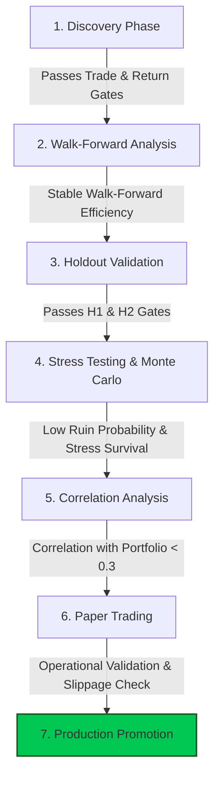

# Candidate 01 — Relative Strength Research Specification

## 1. Research Objective & Scope
The objective is to design, model, and validate a cross-sectional **Relative Strength (RS)** momentum and rotation strategy family. The strategy exploits dispersion in the rate of return and price velocity across cryptocurrency assets. It is designed to act as a source of alpha that is statistically uncorrelated with the existing validated trend-following and volatility-expansion systems (Donchian, Turtle, Supertrend EMA200, and ATR Expansion).

---

## 2. Research Universe & Timeframes

### A. Universe Definition
The research will be conducted strictly on the following **25 crypto assets** extracted from the validated historical database:
* **Majors**: `BTC`, `ETH`
* **Large/Mid-Cap Layer 1s & Ecosystems**: `SOL`, `BNB`, `ADA`, `AVAX`, `DOT`, `NEAR`, `SUI`, `TRX`
* **DeFi & Oracles**: `AAVE`, `LINK`, `UNI`
* **High-Beta & Utility Tokens**: `DOGE`, `ENA`, `HBAR`, `HYPE`, `INJ`, `ONDO`, `RENDER`, `TAO`, `WLD`, `XRP`, `ZEC`, `LTC`

No stocks or assets outside this list will be included in the Candidate 01 boundary.

### B. Timeframes Under Investigation
The strategy configurations will be evaluated across three distinct resolution frequencies:
* **15-Minute (`15m`)**
* **1-Hour (`1H`)**
* **4-Hour (`4H`)**

---

## 3. Evaluation Metrics & Classifications

### A. Minimum Trade Thresholds
To ensure statistical significance and protect against overfitting or selection bias, any candidate configuration must generate a minimum number of trades across the combined backtest and validation periods. Failing to meet these thresholds results in automatic rejection.

| Timeframe | Pass Threshold | Borderline Threshold | Reject Threshold |
| :---: | :---: | :---: | :---: |
| **15m** | $\ge 225$ trades | $200$ to $224$ trades | $< 200$ trades |
| **1H** | $\ge 120$ trades | $105$ to $119$ trades | $< 105$ trades |
| **4H** | $\ge 50$ trades | $45$ to $49$ trades | $< 45$ trades |

### B. Candidate Classification Categories
Following the validation runs, configurations are sorted into four categories:
1. **PASS**: Meets or exceeds the "Pass" trade threshold, demonstrates a positive out-of-sample expectancy ($E(R) > 0$), exhibits a Profit Factor $\ge 1.15$ in all holdout windows, and has a Sharpe Ratio $\ge 1.20$.
2. **BORDERLINE**: Meets the "Borderline" trade threshold, or has minor holdout performance variance. Requires additional macro regime filters or transaction fee optimization before promotion.
3. **WATCHLIST**: Meets trade thresholds but displays highly regime-dependent performance (e.g., highly profitable in bull markets but flat/slightly negative in bear markets). Monitored for macroeconomic regime shifts.
4. **REJECT**: Fails to meet the minimum trade threshold, yields negative net profit, or fails out-of-sample holdout gates.

---

## 4. Methodological Philosophy

### A. Entry Philosophy
The strategy enters positions in assets that occupy the highest quantiles of cross-sectional relative strength at the end of a lookback window. 
* **Signal Window**: Signals are generated strictly at the close of candle $t$, with executions scheduled for the open of candle $t+1$ to ensure zero look-ahead bias.
* **Absolute Threshold Gate (Regime Filter)**: To prevent buying weak assets during market-wide drawdowns, an absolute trend filter (e.g., asset price relative to its moving average, or aggregate market trend status) may act as a gate. If the absolute trend filter is negative, no long positions are taken, regardless of relative ranking.

### B. Exit Philosophy
Exits are executed based on ranking decay or risk-limit breach:
* **Rank Decay (Rotation)**: A position is closed when the asset drops below a specified rank threshold (e.g., falls out of the top $N$ assets, or drops below the median rank of the universe).
* **Volatility-Based Hard Exits**: Stop Loss (SL) and Take Profit (TP) levels are established at entry using Average True Range (ATR) multipliers to manage individual trade tail risk.
* **Time-Based Exits**: Positions can be forced closed if they do not achieve profit targets within a maximum holding period (measured in bars).

### C. Portfolio Construction Philosophy
* **Capital Allocation**: Capital is divided equally among active slots (e.g., if max positions $K = 3$, each position receives $33.3\%$ of available equity) or sized using a risk-parity framework (where position size is inversely proportional to rolling volatility).
* **Position Limits**: Max concurrent active positions $K$ will be constrained ($K \in [1, 2, 3, 5]$) to manage capital concentration and margin requirements.
* **Leverage Limits**: Total portfolio leverage is capped at $5\text{x}$ (isolated margin), matching exchange safety rules.

---

## 5. Parameter & Metric Space

### A. Possible Ranking Metrics
To evaluate relative strength, the research will test several mathematical formulations:
1. **Simple Rate of Return (Momentum)**:
   $$R_i(t, L) = \frac{\text{Close}_i(t) - \text{Close}_i(t-L)}{\text{Close}_i(t-L)}$$
   where $L$ is the lookback period.
2. **Exponentially Weighted Returns**:
   A momentum metric placing higher weight on recent candle closes to capture accelerating trends.
3. **Volatility-Normalized Return (Sharpe-like Ratio)**:
   $$\text{VNR}_i(t, L) = \frac{\text{Mean}(R_i)}{\sigma_i(L)}$$
   where $\sigma_i(L)$ is the rolling standard dev of returns over lookback $L$.
4. **Linear Regression Slope**:
   The slope of the least-squares regression line fit to log prices over lookback $L$, normalized by the standard error of the regression to reward linear trend consistency.
5. **Distance from High**:
   $$\text{DFH}_i(t, L) = \frac{\text{Close}_i(t)}{\max_{j \in [0, L-1]} \text{High}_i(t-j)}$$

### B. Rebalance Frequencies
* **Bar-by-Bar**: Rank calculations and rebalancing occur at the close of every candle (15m, 1H, 4H).
* **Interval-Based**: Rank is evaluated every $N$ bars (e.g., every 24 bars for the 1H timeframe).
* **Threshold-Based**: Rebalancing is triggered only if a new asset outperforms an currently held asset by a significant percentage spread.

### C. Parameter Sweep Space
The optimization engine will sweep the following parameter ranges:
* **Lookback Windows ($L$)**: $12, 24, 48, 96, 168$ bars.
* **Max Positions ($K$)**: $1, 2, 3, 5$ assets.
* **Exit Rank Threshold**: Exit if rank falls below Top $K$, Top $2K$, or Median ($12.5$).
* **Stop Loss Multiplier ($M_{\text{SL}}$)**: $1.5, 2.0, 2.5, 3.0, 4.0 \times \text{ATR}_{10}$.
* **Take Profit Multiplier ($M_{\text{TP}}$)**: Fixed ratios relative to stop distance ($1:1, 1:1.5, 1:2, 1:3$) or no fixed TP (running on rank decay only).

---

## 6. Expected Risks & Failure Modes

### A. Key Risks
* **Execution Friction**: Frequent rotation increases turnover, causing performance to degrade under taker fees ($0.045\%$) and slippage ($0.05\%$).
* **Liquidity Constraints**: Executing market orders on lower-cap altcoins within the 25-asset universe may suffer from thin order books during volatile periods.
* **Leverage Flushes**: Systematic market-wide liquidations (e.g., BTC dropping $15\%$ in minutes) cause high-correlation sell-offs, breaching stop losses on all long positions simultaneously.

### B. Potential Failure Modes
* **Whipsawing in Rangebound Regimes**: If the market has no clear directional leadership, assets will rotate into the top rank momentarily, trigger entry, and immediately mean-revert, resulting in a series of small losses.
* **Lagging Fast Rotations**: If the lookback $L$ is too long, the strategy will buy historical leaders that have already peaked, missing the initial phase of the trend. If $L$ is too short, the strategy will react to noise, increasing transaction costs.

---

## 7. Validation Pipeline & Promotion Criteria

The validation pipeline enforces a strict progression gate to prevent overfitting and guarantee system robustness before live capital deployment.

### A. The Seven Validation Stages

1. **Discovery (In-Sample Testing)**:
   * **Period**: 2023-02-01 to 2024-12-31.
   * **Goal**: Establish candidate configurations that generate stable equity curves and meet minimum trade thresholds.
2. **Walk-Forward Analysis (WFA)**:
   * **Goal**: Evaluate parameter stability by rolling optimization windows forward in time. This tests whether parameters optimized in-sample remain viable in adjacent out-of-sample periods.
3. **Holdout Validation (Out-of-Sample Testing)**:
   * **Period 1 (H1)**: 2025-01-01 to 2025-12-31.
   * **Period 2 (H2)**: 2026-01-01 to Present.
   * **Gates**: The out-of-sample periods must confirm that performance metrics (Profit Factor, Sharpe, Win Rate) do not decay by more than $30\%$ compared to in-sample metrics.
4. **Event Simulation (Regime Stress Testing)**:
   * **Goal**: Retroactively run the strategy through historic, high-stress volatility events:
     * *The FTX Collapse (Nov 2022)*
     * *The USDC Depeg (March 2023)*
     * *The August 5 carry-trade unwind (2024)*
   * **Requirement**: Strategy must not experience drawdowns exceeding planned risk limits, and circuit breakers must function correctly.
5. **Monte Carlo Simulations**:
   * **Goal**: Resample the strategy's historical trade ledger $10,000$ times with randomized ordering and parameter jitter.
   * **Requirement**: Probability of a $30\%$ drawdown must be $< 5.0\%$, and risk of ruin ($50\%$ drawdown) must be $< 1.0\%$.
6. **Correlation Analysis**:
   * **Goal**: Calculate the Pearson correlation coefficient of Candidate 01's daily returns against existing systems.
   * **Requirement**: Correlation with Donchian, Turtle, Supertrend EMA200, and ATR Expansion strategies must be $< 0.30$ to prove independent alpha generation.
7. **Paper Trading (Pre-Live Execution)**:
   * **Goal**: Deploy the strategy in a simulated live brokerage environment using real-time WebSockets and order books.
   * **Requirement**: Run for a minimum of 30 days or 25 trades. Slippage and execution latency must match backtest assumptions.

### B. Promotion Criteria Checklist
To promote a Relative Strength configuration from **Research** to **Live Production**, it must satisfy the following checklist:
* [ ] **Minimum Trade Density**: Meets the timeframe-specific trade counts.
* [ ] **Out-of-Sample Performance**: Profit Factor $\ge 1.15$ and Expectancy $> 0.1\text{R}$ in both H1 and H2.
* [ ] **Uncorrelated Alpha**: Daily return correlation against portfolio strategy mix remains $< 0.30$.
* [ ] **Monte Carlo Safety**: Max simulated drawdown remains below $25\%$ at the $95\%$ confidence level.
* [ ] **Execution Viability**: Latency audit confirms order routing completes within $500\text{ms}$, and realized slippage is within the $0.05\%$ backtest allocation.
* [ ] **Operational Robustness**: Paper engine successfully recovers state, handles exchange WebSocket disconnects, and manages rate limits without failures.
* [ ] **Formal Sign-Off**: Verification walkthrough compiled, reviewed, and approved.
