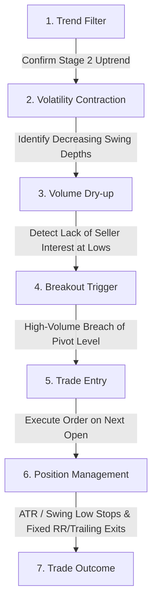

# Candidate 02 — Volatility Contraction Pattern (VCP) Research Specification

## 1. Research Objective & Scope
The objective of this research phase is to design, define, and evaluate a systematic, rules-based **Volatility Contraction Pattern (VCP)** strategy family. 

Popularized qualitatively by Mark Minervini, the VCP is a structural chart pattern indicating that an asset's price is consolidating under an accumulation regime. As overhead supply is absorbed, price fluctuations become narrower (pullback depths decrease), and volume dries up. When supply is fully exhausted, a catalyst triggers a high-volume breakout, initiating a rapid price expansion.

This specification converts this discretionary chart-reading concept into a **100% deterministic, machine-readable mathematical model** suitable for systematic backtesting and parameter space optimization across cryptocurrency assets. It is designed to act as an independent source of momentum-breakout alpha, targetting low correlation to existing trend-following systems.

---

## 2. Research Universe & Timeframes

### A. Universe Definition
The research will be conducted strictly on the following **25 crypto assets** extracted from the historical database:
* **Majors**: `BTC`, `ETH`
* **Large/Mid-Cap Layer 1s & Ecosystems**: `SOL`, `BNB`, `ADA`, `AVAX`, `DOT`, `NEAR`, `SUI`, `TRX`
* **DeFi & Oracles**: `AAVE`, `LINK`, `UNI`
* **High-Beta & Utility Tokens**: `DOGE`, `ENA`, `HBAR`, `HYPE`, `INJ`, `ONDO`, `RENDER`, `TAO`, `WLD`, `XRP`, `ZEC`, `LTC`

### B. Timeframes Under Investigation
The strategy configurations will be evaluated across three resolutions:
* **15-Minute (`15m`)**
* **1-Hour (`1H`)**
* **4-Hour (`4H`)**

---

## 3. Methodological Philosophy of VCP

The VCP strategy is built around six core structural components:

### A. Trend Component
The VCP is fundamentally a trend-continuation pattern. It must only be traded in assets experiencing a strong structural uptrend (Mark Minervini's "Stage 2" uptrend). Entering patterns in sideways or downtrending assets increases the probability of failed breakouts and capital erosion.
* **Objective**: Confirm that the asset's longer-term direction is positive before looking for consolidation patterns.

### B. Contraction Component
The hallmark of the VCP is a series of price contractions (waves/pullbacks) that grow progressively smaller from left to right. Each contraction represents a shakeout of impatient holders and absorption of overhead sellers by institutional buyers.
* **Objective**: Measure the depth of successive price swings (swing high to swing low) and verify that they are decreasing monotonically (e.g., $30\% \rightarrow 15\% \rightarrow 8\% \rightarrow 3\%$).

### C. Volume Contraction Component
As the pattern reaches its apex (the right side of the structure), the supply of available tokens must dry up. This is visible as a significant reduction in volume, especially during the final narrow contraction wave.
* **Objective**: Define metrics that confirm volume is substantially below its historical average, verifying that sellers are exhausted and that thin buying pressure can trigger an explosive breakout.

### D. Breakout (Pivot) Component
The entry signal is triggered when the price breaks above the consolidation's overhead resistance line (the "pivot point"). A valid breakout should ideally be accompanied by an expansion in volatility and a spike in volume, representing the arrival of aggressive momentum buyers.
* **Objective**: Define a deterministic threshold (e.g., highest close or highest high of the last consolidation wave) that signals the start of the expansion phase.

### E. Risk & Stop Loss Philosophy
VCP setups are highly attractive due to their asymmetric risk-reward profile. Because the entry occurs at the apex of volatility contraction, the stop loss can be set very close to the entry price (typically just below the most recent, tightest swing low).
* **Objective**: Protect capital using a tight, objective stop loss linked to the structure of the pattern, rather than a arbitrary percentage drop.

### F. Exit & Position Management Philosophy
Once a breakout succeeds, the strategy should capture the resulting price expansion while protecting accumulated profits from sharp reversals.
* **Objective**: Evaluate trailing stops, fixed risk-reward targets, and time-based exits to determine the optimal way to harvest the momentum edge.

---

## 4. Expected Market Behavior

### A. Expansion Regimes (Bull Markets)
VCP is highly effective in broad, liquid bull markets. Breakouts are met with immediate follow-through, and high-beta altcoins run aggressively, achieving multiples of the initial risk.

### B. Contraction Regimes (Bear Markets)
In bear markets, consolidation patterns are highly prone to failure. Breakouts turn into "bull traps" or whipsaws due to the lack of supportive capital flow. The trend filter must successfully block entries during these regimes.

### C. Correlation and Diversification
Because VCP trades structural breakouts from periods of low volatility, it should have a low correlation to standard trend-following systems (which buy during high-volatility extensions) and mean-reversion systems.

---

## 5. Evaluation Metrics & Progress Gates

To progress from Research to live Paper Trading, any VCP configuration must pass the standard 7-stage validation pipeline:
1. **Discovery (In-Sample Testing)**: Sweep the parameter space from 2023-02-01 to 2024-12-31.
2. **Walk-Forward Analysis (WFA)**: Confirm parameter stability across rolling out-of-sample segments.
3. **Holdout Validation**: Validate on out-of-sample periods (H1: 2025-01-01 to 2025-12-31, H2: 2026-01-01 to Present). Out-of-sample Sharpe Ratio must be $\ge 1.20$.
4. **Stress Testing**: Pass historical regime event simulations (e.g., FTX collapse, August 2024 carry-trade unwind).
5. **Monte Carlo Analysis**: Run 10,000 resamples; risk of ruin ($50\%$ drawdown) must be $< 1.0\%$.
6. **Correlation Gate**: Pearson correlation of daily returns against existing active systems must be $< 0.30$.
7. **Paper Trading**: Execute live simulated trades for a minimum of 30 days to verify execution costs and slippage.

### Minimum Trade Density Gates
To prevent overfitting to a small number of trades, candidates must meet the following minimum trade counts across the combined backtest and validation periods:

| Timeframe | Pass Threshold | Borderline Threshold | Reject Threshold |
| :---: | :---: | :---: | :---: |
| **15m** | $\ge 225$ trades | $200$ to $224$ trades | $< 200$ trades |
| **1H** | $\ge 120$ trades | $105$ to $119$ trades | $< 105$ trades |
| **4H** | $\ge 50$ trades | $45$ to $49$ trades | $< 45$ trades |
