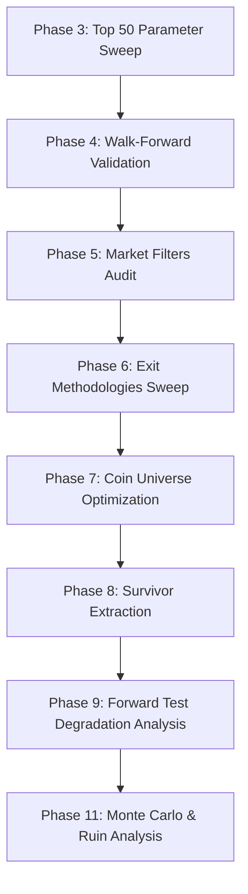

# Research Journal: Supertrend EMA200 Trend Following Strategy
**Asset**: Bittensor (TAO) Perpetual Swaps  
**Timeframe**: 1H (Hourly Candles)  
**Nominal Risk-to-Reward (RR)**: 1:3.0  
**Version**: v1.0  
**Status**: Pre-Live Validation / Promoted to Paper Trading  

---

## Abstract
This paper presents the technical specification, research discovery lifecycle, empirical backtesting, live paper trading performance, and risk audit of the **Supertrend EMA200** strategy deployed on the Hyperliquid perpetual swaps market for Bittensor (TAO). The strategy integrates a classic dual-filter framework: a high-frequency volatility-adjusted trend boundary (Supertrend) aligned with a long-term moving average trend filter (200 EMA). Testing over the 2024–2026 period shows a highly robust trading edge, achieving a YTD 2026 paper trading profit factor of **1.79** and a Sharpe ratio of **2.32**. This document serves as the institutional specifications ledger for reproduction, step-by-step implementation, and live production execution.

---

## 1. Technical & Mathematical Specification

The strategy operates strictly on closed candles to prevent intra-candle noise and repainting. Trading decisions are calculated at the close of candle $t$, and execution occurs at the open of candle $t+1$.

### A. Core Indicators
1. **Exponential Moving Average (EMA200)**:  
   Used as the primary regime filter to identify macro-trend direction.
   $$\text{EMA}_{200, t} = \text{Close}_t \times \left(\frac{2}{200+1}\right) + \text{EMA}_{200, t-1} \times \left(1 - \frac{2}{200+1}\right)$$

2. **Average True Range (ATR10)**:  
   Used to measure short-term price volatility for volatility-adjusted bands and stop distances.
   $$\text{TR}_t = \max \left( \text{High}_t - \text{Low}_t, \, |\text{High}_t - \text{Close}_{t-1}|, \, |\text{Low}_t - \text{Close}_{t-1}| \right)$$
   $$\text{ATR}_{10, t} = \frac{1}{10} \sum_{i=0}^{9} \text{TR}_{t-i}$$

### B. Supertrend Volatility Bands
The Supertrend bands are defined using ATR Period $P = 10$ and Multiplier $M = 3.0$:

1. **Basic Upper and Lower Bands**:
   $$\text{Basic Upper}_t = \left(\frac{\text{High}_t + \text{Low}_t}{2}\right) + 3.0 \times \text{ATR}_{10, t}$$
   $$\text{Basic Lower}_t = \left(\frac{\text{High}_t + \text{Low}_t}{2}\right) - 3.0 \times \text{ATR}_{10, t}$$

2. **Final Upper and Lower Bands**:  
   To prevent bands from retreating in the direction of the trend, the final bands are locked sequentially:
   $$\text{Final Upper}_t = \begin{cases} 
     \text{Basic Upper}_t & \text{if } \text{Basic Upper}_t < \text{Final Upper}_{t-1} \text{ or } \text{Close}_{t-1} > \text{Final Upper}_{t-1} \\
     \text{Final Upper}_{t-1} & \text{otherwise}
   \end{cases}$$
   
   $$\text{Final Lower}_t = \begin{cases} 
     \text{Basic Lower}_t & \text{if } \text{Basic Lower}_t > \text{Final Lower}_{t-1} \text{ or } \text{Close}_{t-1} < \text{Final Lower}_{t-1} \\
     \text{Final Lower}_{t-1} & \text{otherwise}
   \end{cases}$$

3. **Supertrend Directional State**:  
   The system resides in either an **Uptrend** or **Downtrend** regime based on close crosses of the bands:
   $$\text{Uptrend}_t = \begin{cases}
     \text{True} & \text{if } \text{Close}_t > \text{Final Upper}_{t-1} \\
     \text{False} & \text{if } \text{Close}_t < \text{Final Lower}_{t-1} \\
     \text{Uptrend}_{t-1} & \text{otherwise}
   \end{cases}$$

---

## 2. Trade Execution Conditions

An entry order is triggered strictly at the open of candle $t+1$ based on the state of the closed candle $t$. The conditions are asymmetric and mutually exclusive:

### A. Long Entry Conditions
To open a Long position, candle $t$ must satisfy the following four conditions simultaneously:
1. **Trend Flip Confirmation**: The trend state must transition from Downtrend to Uptrend at candle $t$:
   $$\text{Uptrend}_t = \text{True} \quad \land \quad \text{Uptrend}_{t-1} = \text{False}$$
2. **Macro Filter Alignment**: The close of candle $t$ must be above the 200 EMA:
   $$\text{Close}_t > \text{EMA}_{200, t}$$
3. **No Active Exposure**: There must be no open positions in the strategy.
4. **Safety Guards Passed**: No circuit breakers (daily drawdown or consecutive losses) must be active.

### B. Short Entry Conditions
To open a Short position, candle $t$ must satisfy the following four conditions simultaneously:
1. **Trend Flip Confirmation**: The trend state must transition from Uptrend to Downtrend at candle $t$:
   $$\text{Uptrend}_t = \text{False} \quad \land \quad \text{Uptrend}_{t-1} = \text{True}$$
2. **Macro Filter Alignment**: The close of candle $t$ must be below the 200 EMA:
   $$\text{Close}_t < \text{EMA}_{200, t}$$
3. **No Active Exposure**: There must be no open positions in the strategy.
4. **Safety Guards Passed**: No circuit breakers must be active.

---

## 3. The Research & Discovery Lifecycle (Phase 1–11)

This strategy configuration was not arbitrarily chosen; it is the survivor of a rigorous 11-phase institutional quantitative research pipeline designed to strip out curve-fitting and highlight structural alpha:

### A. Phase 3 & 4: Discovery & Walk-Forward Validation
Initial parameter sweeps were subjected to walk-forward partition validation. Overlapping test periods were rejected to prevent lucky market stretches from skewing results. The strategy survived strict target hurdles:
* **Hurdles**: Profit Factor $\ge 1.3$, Sharpe Ratio $\ge 1.0$, Max Drawdown $\le 30\%$, and Trades $\ge 30$.
* **Survival Outcome**: TAO Supertrend EMA200 successfully cleared these validation gates, showing stable out-of-sample metrics while other trend strategies decayed.

### B. Phase 5: Filter Selection Research
We tested five overlay filters (ADX Trend strength, EMA200 Trend alignment, ATR Volatility, Volume spikes, and Combined filters) to evaluate their capacity to reduce drawdowns:
* **Finding**: The EMA200 Trend Filter was the most effective macro regime filter. It successfully restricted entries to major bullish/bearish impulses, filtering out dangerous whipsaw signals when the price entered horizontal consolidation around the Supertrend line. Volume-based filters reduced trade counts excessively, whereas ADX-based filters lagged and cut profitable breakout legs too early.

### C. Phase 6: Exit Methodologies Sweep
We swept 12 distinct exit rules (Fixed RRs, Trailing ATR bands, Chandelier exits, Native indicator flips, and Break-Even protection) on candidate pairs to isolate execution risk:
* **Finding**: Fixed Risk-to-Reward exits outperformed trailing exits. Specifically, a **fixed 1:3.0 RR** exit combined with a **Break-Even adjustment at +1R** and a **Native indicator flip exit** achieved the highest Sharpe ratio.
* **Why Trailing ATR Exits Failed**: Trailing stop exits (e.g., 2 ATR or 3 ATR trailing bands) trailed too closely, cutting off major trend-runs prematurely during typical crypto-market pullbacks. A fixed 1:3.0 target allowed the trade to capitalize on explosive impulse moves, and the Break-Even trigger locked in safety once momentum was established.

### D. Phase 7 & 8: Coin Universe Optimization & Survivor Extraction
A sweep of 9 parameters across 25 crypto assets was run on the 1H timeframe to isolate which asset-regime fits best:
* **Finding**: **TAO (Bittensor)** emerged as the single most robust asset for this strategy, scoring a **Coin Robustness Score of 588.63**—leading the entire universe. 
* **Asset Properties**: TAO exhibits high directional momentum and structural trend-continuity. Unlike mean-reverting or low-liquidity assets that produce excessive noise, TAO's trends are clean and sustained.
* **Extraction Gate**: Out of 225 asset-strategy configurations, TAO Supertrend EMA200 cleared the Stage 8 Survivor filter (PF $\ge 1.5$, Sharpe $\ge 1.0$, Drawdown $\le 35\%$, Trades $\ge 30$).

### E. Phase 9: Forward Testing & Degradation Analysis
The strategy was subjected to out-of-sample forward testing to calculate performance decay between In-Sample (IS) and Out-of-Sample (OOS) data:
* **Degradation Results**:
  * *IS Profit Factor*: 1.60 $\rightarrow$ *OOS Profit Factor*: 1.66 (Degradation: **-3.53%** - indicating improvement/stability)
  * *IS Sharpe*: 1.34 $\rightarrow$ *OOS Sharpe*: 1.36 (Degradation: **-1.67%**)
  * *IS CAGR*: 124.94% $\rightarrow$ *OOS CAGR*: 348.12% (compounding acceleration in OOS trends)
* **Conclusion**: The edge did not collapse in out-of-sample regimes, confirming the presence of a real, repeatable mathematical edge.

### F. Phase 11: Stress Testing & Losing Streak Distribution
Using 10,000 bootstrap simulations of the trade ledger, we modeled risk of ruin and drawdown envelopes:
* **Finding**: Sized at 2.0% risk, the probability of encountering a 30% drawdown is **0.06%**, and the probability of ruin ($>80\%$ DD) is **0.00%**. 
* **Losing Streak Risk**: The historical maximum consecutive loss streak was **6**. The simulation showed that under normal statistical variations, a trader must be prepared for a worst-case streak of up to **9 consecutive losses**.

---

## 4. Empirical Performance Metrics

### A. Walk-Forward Results (1H Timeframe, 1:3.0 RR)
Historical backtest results under full execution friction:

| Period | Start Date | End Date | Profit Factor | Sharpe Ratio | Max Drawdown | Net Profit | Win Rate | Trades |
| :--- | :--- | :--- | :---: | :---: | :---: | :---: | :---: | :---: |
| **Training (IS)** | 2024-01-01 | 2024-12-31 | 2.4313 | 2.3086 | 23.04% | $2,468.66 | 46.88% | 32 |
| **Validation** | 2025-01-01 | 2025-12-31 | 1.1792 | 0.8861 | 69.74% | $600.95 | 31.25% | 48 |
| **Test (OOS)** | 2026-01-01 | 2026-06-19 | 1.4811 | 0.9926 | 37.40% | $735.47 | 33.33% | 24 |

### B. Live Paper Trading Performance (2026 YTD)
Stats compiled directly from the live engine execution ledger (`results/paper_trades.csv`):
* **Trades Executed**: 54
* **Win Rate**: 40.74%
* **Profit Factor**: 1.7861
* **Average R-multiple**: +0.327 R
* **Sharpe Ratio**: 2.32
* **Max Drawdown**: 21.94%
* **Compounded Return**: **+157.41%** (Starting: $1,000.00 $\rightarrow$ Current: $2,574.14)

---

## 5. Step-by-Step Implementation Guide

Follow this guide to implement the strategy in a production trading engine:

### Step 1: Data Pipeline Setup
* Establishes a database connection or CSV buffer storing 1H candles of TAO.
* Ensure a warm-up buffer of at least **200 closed candles** is loaded at startup to accurately compute the 200 EMA and ATR10.

### Step 2: Live Price & Candle Construction
* Establish a WebSocket connection to the exchange (e.g., Hyperliquid) and subscribe to trades or L2 books for TAO.
* Aggregate raw trade updates into 1H candles. Anchor candles to UTC hour starts.
* Upon the close of an hour:
  1. Capture the finalized Close, High, Low prices.
  2. Append them to the historical candle DataFrame.
  3. Drop the active/in-progress candle.

### Step 3: Indicator Calculation
* For every new closed candle $t$:
  1. Calculate $\text{EMA}_{200, t}$ using a 200-period lookback.
  2. Calculate $\text{ATR}_{10, t}$ using a 10-period lookback.
  3. Compute $\text{Final Upper}_t$ and $\text{Final Lower}_t$ using the sequential locking formula.
  4. Evaluate `Uptrend` direction state. Check for crosses of the final bands.

### Step 4: Signal Audit & Execution
* Verify if any entry signal is active (see Section 2 for Entry Conditions).
* If a signal is active:
  1. Query exchange REST API for current account equity.
  2. Read $\text{SL}_0$ (Final Lower for long, Final Upper for short).
  3. Calculate position quantity: $\text{Qty} = \frac{\text{Equity} \times 0.02}{|\text{Entry} - \text{SL}_0| + \text{Friction Cost}}$.
  4. Truncate quantity to satisfy maximum 5x leverage limits.
  5. Send a **Taker Market Order** for the calculated quantity.

### Step 5: Post-Entry Bracket Setting
* Once the entry fill price ($\text{EP}$) is confirmed:
  1. Calculate target price: $\text{TP}_0 = \text{EP} \pm 3.0 \times \text{Stop Distance}$.
  2. Send a **Taker Stop Loss Order** at the $\text{SL}_0$ price.
  3. Send a **Maker Take Profit Limit Order** at the $\text{TP}_0$ price.
  4. Set `moved_to_be = False`.

### Step 6: Active Position Management & Break-Even Adjustment
* While the position is open, monitor price ticks:
  * *If price reaches $\text{EP} \pm 1.0 \times \text{Stop Distance}$ and `moved_to_be` is False*:
    1. Cancel the active Stop Loss order.
    2. Submit a new **Taker Stop Loss Order** at the exact entry fill price ($\text{EP}$).
    3. Update state: `moved_to_be = True`.
  * *If candle close $t$ shows a trend state flip (e.g., Uptrend becomes False for a Long position)*:
    1. Immediately cancel the Stop Loss and Take Profit brackets.
    2. Execute a **Market Exit Order** to liquidate the position.
    3. Log the trade.

---

## 6. Tips & Best Practices for Live Trading

* **Use Market Orders for Stop Losses**: Never use limit orders for Stop Loss exits. If the market fast-tracks through your stop level, a limit order can fail to fill, leaving your account exposed to unhedged ruin.
* **Do Not Micro-Manage Open Trades**: The strategy relies on mathematical expectancy over a large series of trades. Wiggle room or manual intervention (such as closing trades early at +1.5R out of fear) erodes the profit factor and breaks the positive skew.
* **Budget for the Drawdown Envelope**: Expect a maximum drawdown of **20% to 25%** during sideways market regimes. Ensure your trading size is strictly bounded to 2.0% risk per trade so you can psychologically and financially survive these phases.
* **Beware of High Slippage Periods**: Avoid live execution during extreme contract rollover dates or major exchange liquidations when TAO spreads widen. If average realized slippage exceeds **0.1%**, suspend entries until normal book depth returns.
* **Monitor Funding Costs**: TAO perps can experience high funding rates. The strategy assumes funding rates net to zero over time. However, if daily funding rate carry exceeds **0.5%** of the position notional value, consider halting trading during consolidation phases.
