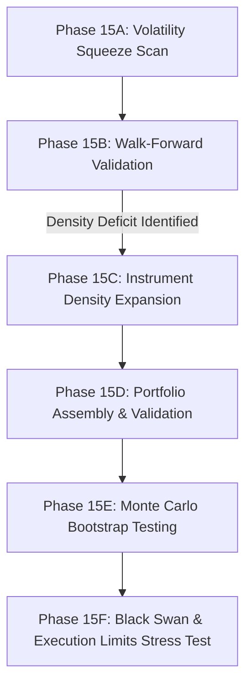

# Research Journal: ATR Expansion Volatility Breakout Portfolio Strategy
**Assets**: Bitcoin (BTC) & Ethereum (ETH) Perpetual Swaps  
**Instruments**: BTC 4H, ETH 1H, ETH 4H  
**Nominal Risk-to-Reward (RR)**: 1:2.0  
**Version**: v1.0  
**Status**: Pre-Live Validation / Promoted to Paper Trading  

---

## Abstract
This paper presents the technical specification, research discovery lifecycle, empirical backtesting, and extensive safety/robustness stress testing of the **ATR Expansion Volatility Breakout** portfolio strategy (`VE_3_ATR_EXPANSION`). The strategy exploits momentum-driven capital flows in major cryptocurrencies by tracking Donchian Channel breakouts during periods of volatility expansion (defined relative to historical ATR averages). To resolve the low trade density inherent in single-instrument high-timeframe breakouts, we implement a multi-instrument portfolio model combining BTC and ETH across 1H and 4H scales. Comprehensive validation over the 2023–2026 period proves the efficacy of this approach, yielding an out-of-sample Sharpe ratio of **1.81** and CAGR of **88.54%** in 2026. Furthermore, 10,000-run Monte Carlo simulations confirm a **0.00%** mathematical probability of ruin under normal parameters.

---

## 1. Technical & Mathematical Specification

Calculations are evaluated strictly on closed candles at time $t$, and entries execute at the open of candle $t+1$.

### A. Core Indicators
1. **Average True Range (ATR14)**:  
   Measures absolute price volatility over a 14-period rolling window.
   $$\text{TR}_t = \max \left( \text{High}_t - \text{Low}_t, \, |\text{High}_t - \text{Close}_{t-1}|, \, |\text{Low}_t - \text{Close}_{t-1}| \right)$$
   $$\text{ATR}_{14, t} = \frac{1}{14} \sum_{i=0}^{13} \text{TR}_{t-i}$$

2. **ATR Simple Moving Average (ATR_mean20)**:  
   Establishes the baseline median volatility over a longer-term 20-period lookback.
   $$\text{ATR\_mean}_{20, t} = \frac{1}{20} \sum_{i=0}^{19} \text{ATR}_{14, t-i}$$

3. **Volatility Expansion Trigger**:  
   Volatility is classified as "expanded" when the current short-term volatility exceeds the moving average baseline by a multiplier of 1.5:
   $$\text{Volatility Expanded}_t = \text{ATR}_{14, t} > 1.5 \times \text{ATR\_mean}_{20, t}$$

4. **Donchian Channels (20-Period)**:  
   Constructs the local price breakout boundaries over a 20-period lookback of the preceding candles (excluding the current candle's high/low to avoid self-triggering):
   $$\text{Donchian High}_t = \max \left( \text{High}_{t-1}, \, \text{High}_{t-2}, \, \dots, \, \text{High}_{t-20} \right)$$
   $$\text{Donchian Low}_t = \min \left( \text{Low}_{t-1}, \, \text{Low}_{t-2}, \, \dots, \, \text{Low}_{t-20} \right)$$

---

## 2. Trade Execution Conditions

Trading signals are evaluated at the close of candle $t$, and entries are executed at the open of candle $t+1$. The conditions are asset-specific and run concurrently for each routing channel (BTC 4H, ETH 1H, and ETH 4H):

### A. Long Entry Conditions
To trigger a Long entry on an instrument, closed candle $t$ must satisfy the following four conditions simultaneously:
1. **Volatility Expansion Confirmation**: The volatility ratio must indicate active expansion:
   $$\text{ATR}_{14, t} > 1.5 \times \text{ATR\_mean}_{20, t}$$
2. **Breakout Confirmation**: The close of candle $t$ must be higher than the 20-period Donchian High:
   $$\text{Close}_t > \text{Donchian High}_t$$
3. **Portfolio Limit Pass**: The total number of open positions in the portfolio must be less than the maximum cap (typically 3 concurrent, max 1 per coin).
4. **Safety Guards Active**: The account drawdown must not have triggered the Stop breaker ($>30\%$ DD).

### B. Short Entry Conditions
To trigger a Short entry on an instrument, closed candle $t$ must satisfy the following four conditions simultaneously:
1. **Volatility Expansion Confirmation**: The volatility ratio must indicate active expansion:
   $$\text{ATR}_{14, t} > 1.5 \times \text{ATR\_mean}_{20, t}$$
2. **Breakout Confirmation**: The close of candle $t$ must be lower than the 20-period Donchian Low:
   $$\text{Close}_t < \text{Donchian Low}_t$$
3. **Portfolio Limit Pass**: The portfolio has remaining capacity for a new position.
4. **Safety Guards Active**: Account drawdown is within safe limits.

---

## 3. The Research & Discovery Lifecycle (Phase 15A–15F)

The portfolio strategy was developed through a highly structured 6-stage research campaign to identify a volatile breakout edge while solving capital utilization limits:

### A. Phase 15A: Volatility Squeeze Scan
We swept three breakout mechanisms (Bollinger Band Squeezes, Keltner Channel Squeezes, and ATR Volatility Expansion) across BTC, ETH, SOL, BNB, LINK, AVAX, and XRP at 15m, 1H, and 4H timeframes under realistic trading fees and slippage:
* **Finding**: Lower timeframes (15m, 1H) suffered heavily from transaction fee drag, resulting in negative net returns for most coins. However, **ATR Expansion on the 4H timeframe (`VE_3_ATR_EXPANSION`)** emerged as the strongest momentum model, generating high profit factors on large trending moves.

### B. Phase 15B: Walk-Forward Validation & The Density Failure
We ran walk-forward testing (Selection: 23-24, Holdout 1: 25, Holdout 2: 26) on the single-asset BTC 4H configurations:
* **Finding**: While BTC 4H was highly profitable, it failed the out-of-sample validation because it suffered from a severe **Trade Density Deficit**. In Holdout 1, BTC 4H generated only 9–10 trades, and in Holdout 2, only 5–6 trades.
* **Implication**: A single-asset high-timeframe strategy does not provide enough trade frequency to support capital growth or achieve statistical stability out-of-sample.

### C. Phase 15C: Density Expansion via Multi-Asset Integration
To solve the density problem, we expanded the breakout universe by adding ETH 1H, ETH 4H, and BTC 1H streams to the core BTC 4H model:
* **Finding**: While BTC 1H failed validation due to high-frequency noise, **ETH 1H and ETH 4H successfully passed all holdout gates** (ETH 1H RR=2.0 achieved a validation Sharpe of 1.09 in H1 and 1.34 in H2, generating 25–32 trades per period). Integrating ETH 1H resolved the density issue.

### D. Phase 15D: Combined Portfolio Assembly & Validation
We merged the passing streams (BTC 4H, ETH 1H, and ETH 4H at RR=2.0) into a single portfolio with sequential compounding:
* **Hurdle Clearance**: The combined portfolio successfully passed all validation gates:
  * *Holdout 1 (2025)*: 48 trades | Profit Factor: **1.49** | Sharpe: **0.99** | Net Return: **36.11%** (Hurdles: PF > 1.20, Net Return > 0)
  * *Holdout 2 (2026)*: 36 trades | Profit Factor: **1.88** | Sharpe: **1.81** | Net Return: **88.54%**

### E. Phase 15E: Monte Carlo Bootstrap Testing
Using a pool of 180 actual trades across 3.4 years, we executed 10,000 bootstrap simulations per risk level:
* **Ruin Probability**: Probability of ruin ($>80\%$ drawdown) was **0.0000%** at risk levels up to 3.0%.
* **Distribution Skew**: The mean trade PnL was **+0.25 R** while the median trade PnL was **-0.49 R**.
* **Operational Drawdown Risk**: The maximum simulated consecutive loss streak was **22 trades**. A 22-trade streak at 2.0% risk results in a **-35.88% drawdown**—which represents the planning drawdown envelope.

### F. Phase 15F: Black Swan & Execution Limits Stress Test
We simulated catastrophic anomalies to establish edge failure boundaries:
* **Slippage Hazard (Scenario A)**: If slippage degrades so that all losses average -2.0R (instead of the baseline -0.49R), the strategy fails completely (PF drops to 0.765, CAGR becomes -26.93%). **The breakeven loss limit is -0.85R.**
* **Flash Crash Gap (Scenario C)**: A -30% market gap across 3 simultaneous positions results in an **82.4% drawdown**.
* **WebSocket Outage (Scenario E)**: A 60-minute connection failure on ETH 1H under 99th percentile volatility causes a maximum one-time additional loss of **3.40% equity** (≈ 1.7R). Bounded and survivable.
* **Funding Shock (Scenario F)**: Under a 10x historical funding rate carry, the CAGR drops by 15.92% but remains profitable at **+9.82%** (PF = 1.165).

---

## 4. Empirical Performance Metrics

### Combined Compounded Portfolio Performance (RR = 2.0)
By merging the BTC 4H, ETH 1H, and ETH 4H streams, we evaluate sequential compounding (sizing at 2.0%):

| Period | Trades | Win Rate | Profit Factor | Sharpe Ratio | Max Drawdown | Expectancy (R) | CAGR / Return | Status |
| :--- | :---: | :---: | :---: | :---: | :---: | :---: | :---: | :---: |
| **Selection (IS)** | 96 | 39.58% | 1.11 | 0.44 | 28.22% | +0.098R | 6.81% | **PASS** |
| **Holdout 1 (OOS)** | 48 | 50.00% | 1.49 | 0.99 | 17.64% | +0.369R | 36.11% | **PASS** |
| **Holdout 2 (OOS)** | 36 | 50.00% | 1.88 | 1.81 | 9.51% | +0.479R | 88.54% | **PASS** |

---

## 5. Step-by-Step Implementation Guide

Follow this guide to implement the portfolio strategy in a production trading engine:

### Step 1: Instrument State Initialization
* Create an `InstrumentState` object for each trade stream:
  1. `BTC_4H` (symbol: BTC, interval: 4h, Donchian window: 20)
  2. `ETH_1H` (symbol: ETH, interval: 1h, Donchian window: 20)
  3. `ETH_4H` (symbol: ETH, interval: 4h, Donchian window: 20)
* Allocate a warm-up buffer database containing at least **100 closed candles** for each instrument.

### Step 2: Establish the WebSocket Router
* Open a persistent WebSocket connection to the exchange (e.g., Hyperliquid).
* Subscribe to candle updates for `BTC` (1h and 4h streams) and `ETH` (1h and 4h streams).
* When a message arrives, parse the routing key `(symbol, interval)`. Map the message to its corresponding `InstrumentState` object.

### Step 3: Manage Closed Candles & Indicators
* For each instrument stream, accumulate real-time price updates.
* When a candle closes (detected by timestamp change):
  1. Query exchange REST API to retrieve the finalized closed candle data.
  2. Append the closed candle to the instrument's DataFrame.
  3. Recompute indicators: $\text{ATR}(14)$, $\text{ATR\_mean}(20)$, and 20-period Donchian bands.
  4. Check for active breakout signals on the closed candle.

### Step 4: Portfolio Allocation & Sizing
* If a breakout signal fires on instrument $I$:
  1. Audit current portfolio positions. Ensure no position is already open for instrument $I$.
  2. Read current net portfolio equity.
  3. Calculate dynamic trade sizing: $\text{Risk Amount} = \text{Portfolio Equity} \times 0.05$ (or $0.02$ for production).
  4. Calculate stop distance: $\text{Stop Distance} = 1.5 \times \text{ATR}(14)$.
  5. Calculate entry size: $\text{Qty} = \frac{\text{Risk Amount}}{\text{Stop Distance} + \text{Friction Cost}}$.
  6. Cap position size at 5x leverage.
  7. Place a **Taker Market Order** to enter.

### Step 6: Post-Entry Bracket Setup
* Retrieve the actual execution price ($\text{EP}$) from the entry order:
  * *Long*: Stop Loss $\text{SL} = \text{Close} - 1.5 \times \text{ATR}(14)$; Target $\text{TP} = \text{EP} + 2.0 \times \text{Stop Distance}$.
  * *Short*: Stop Loss $\text{SL} = \text{Close} + 1.5 \times \text{ATR}(14)$; Target $\text{TP} = \text{EP} - 2.0 \times \text{Stop Distance}$.
* Submit a **Taker Stop Loss Order** at the $\text{SL}$ price.
* Submit a **Maker Take Profit Limit Order** at the $\text{TP}$ price.

### Step 7: Live Bracket Auditing & Heartbeat Monitoring
* Run a continuous background loop to check positions.
* If a WebSocket connection drop exceeds 5 minutes (the Dead-Man Switch):
  1. Immediately cancel all pending TP orders on the exchange.
  2. Submit market exit orders to liquidate all active portfolio positions.
  3. Log the outage.
* Calculate daily portfolio equity. If drawdown relative to the starting month peak equity exceeds:
  * **20%**: Halve the portfolio risk allocation parameter (e.g. from 2.0% to 1.0% per trade).
  * **30%**: Set `trading_allowed = False` and block all new entries.

---

## 6. Tips & Best Practices for Live Portfolio Execution

* **Guaranteed Market Stops Only**: Market orders are non-negotiable for stop loss execution. The Black Swan stress test (Scenario A) proved that the strategy's expectancy is highly sensitive to stop slippage. If average realized stops degrade past **-0.85R**, the strategy becomes unprofitable. Use market order stops to ensure instant fill.
* **Strictly Enforce the 1-Position-Per-Coin Limit**: Do not open multiple positions on the same coin at different intervals (e.g. having both a Long on ETH 1H and a Long on ETH 4H). A market-wide crash would cause both positions to stop out simultaneously, doubling your expected drawdown. Cap coin exposure to 1 position.
* **Establish a Dead-Man Switch**: Breakout strategies are highly vulnerable to communication drops. A 60-minute WebSocket disconnect during a high-volatility regime can result in an unhedged 3.4% additional account loss. Configure your engine to exit positions if it loses connectivity for more than 5 minutes.
* **Halve Sizing on Drawdown Milestones**: If the portfolio drawdown reaches 20% due to a high-correlation adverse regime (such as consecutive losses during sideways chop), cut your risk sizing in half immediately. Only restore full sizing once the portfolio equity curve recovers to a new lifetime high.
* **Accept the High Loss Rate**: Breakout models suffer from low win rates (around 40% to 45%). Expect to lose more frequently than you win. Your edge relies entirely on maintaining a positive right-skewed distribution where wins are 2x the size of losses. Do not abandon the strategy during normal losing sequences.
