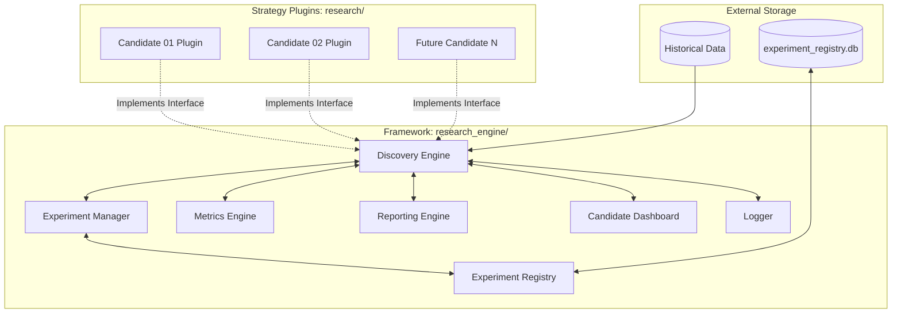

# QRP Framework v2.0 — Discovery Engine Architecture Specification

This document presents the system architecture for the **Quantitative Research Platform (QRP) Framework v2.0**. This is an institutional-grade, strategy-agnostic framework designed to automate quantitative discovery, parameter sweeps, out-of-sample validation, and reporting for multiple strategy candidates.

---

## 1. Overall System Architecture

The QRP Framework v2.0 architecture decouples the execution framework from the trading strategy logic. The framework acts as an orchestrator, handling data ingest, parameter generation, simulation loops, metrics calculation, and reporting. Strategies are implemented as pluggable modules that conform to a strict interface contract.



---

## 2. Component Responsibilities

* **Discovery Engine (`discovery_engine.py`)**: The primary coordinator. Responsible for parsing run-time parameters, loading datasets, loading the targeted strategy plugin, constructing the parameter sweep matrix, executing backtesting loops asynchronously, and returning raw transaction ledgers.
* **Experiment Manager (`experiment_manager.py`)**: Responsible for managing experiment metadata. Generates unique, immutable experiment IDs (`C{CandidateID}-E{ExperimentID}`), maps parameters, compiles the reproducibility manifest, and coordinates folder structures.
* **Strategy Interface (`strategy_interface.py`)**: Declares the abstract base classes and interfaces that strategy plugins must implement (metadata, parameter spaces, custom preprocessors, and signal generators).
* **Metrics Engine (`metrics_engine.py`)**: Computes standardized, institutional quantitative metrics (Sharpe, Sortino, Profit Factor, Expectancy, Win Rate, Drawdown details) from raw transaction ledgers.
* **Reporting Engine (`reporting.py`)**: Formats metrics and metadata into human-readable markdown summaries, CSV records, and plot paths.
* **Logger (`logger.py`)**: Implements thread-safe, multi-level file logging (INFO, WARNING, ERROR, SUCCESS) segregated per candidate and per experiment.
* **Experiment Registry (`experiment_registry.py`)**: Manages the persistent registry state (JSON/SQLite) to ensure cross-candidate registry records are maintained.
* **Candidate Dashboard (`candidate_dashboard.py`)**: Compiles and renders real-time execution statistics (stages, progress, start/end timestamps, operational statuses) across multiple active candidates.

---

## 3. Data Flow

```
[User Command / Config] 
         │
         ▼
 1. Initialize Run ──────► [Discovery Engine]
                                │
                                ├─► Load Data (Bar / Ticks)
                                ├─► Load Candidate Plugin (Dynamic Import)
                                │
                                ▼
 2. Generate Sweep Matrix ──► [Experiment Manager]
                                │
                                ├─► Assign C{ID}-E{ID}
                                ├─► Create Output Folder
                                │
                                ▼
 3. Execute Loop ─────────► [Simulation Engine] 
                                │
                                ├─► Apply Plugin Preprocessor
                                ├─► Apply Plugin Signal Generator (Tick/Bar Loop)
                                ├─► Simulate Execution, Slippage & Costs
                                │
                                ▼
 4. Calculate Statistics ──► [Metrics Engine] (Transforms trade ledger to performance arrays)
                                │
                                ▼
 5. Persist Results ──────► [Reporting & Registry] (Writes JSON Manifest, CSV trades, PDF/MD reports)
```

---

## 4. Folder Structure

The directory division ensures that the core engine infrastructure is segregated from individual strategy repositories:

```text
research_engine/                     <── Central Framework Root
├── core/                            <── Architectural Source Modules
│   ├── discovery_engine.py
│   ├── experiment_manager.py
│   ├── strategy_interface.py
│   ├── metrics_engine.py
│   ├── reporting.py
│   ├── logger.py
│   ├── experiment_registry.py
│   └── candidate_dashboard.py
├── configs/                         <── Centralized Framework Configs (runner.yaml)
├── outputs/                         <── Dynamic Output Data Storage (CSV, JSON manifests)
├── archives/                        <── Zipped Completed Experiment Paths
├── docs/                            <── Specifications & Documentation
└── tests/                           <── Core Engine Unit and Integration Tests

research/                            <── Candidate Repository Root
├── candidate_01_relative_strength/  <── Strategy Candidate Plugin Folder
│   ├── README.md
│   ├── hypothesis.md
│   ├── signal_design_spec.md
│   └── code/                        <── Candidate Signal Script (imported by DE)
│       └── strategy_plugin.py
└── candidate_02_mean_reversion/
```

---

## 5. Plugin Philosophy

Strategies are strictly structured as **plugins**. The core engine does not import or contain any strategy logic. A candidate plugin registers with the framework by placing its code inside the `research/candidate_{id}/` directory and exposing a subclass of the framework's `BaseStrategyPlugin`. 

This design allows:
* **Separation of Concerns**: Strategy researchers focus only on signaling and parameter logic, without touching the backtest loops or reporting layers.
* **Hot Pluggability**: Adding a new candidate strategy requires zero edits to the central framework code.
* **Test Isolation**: Core engine tests are written using simple mock plugins, preventing changes to strategy code from breaking the core platform test suites.

---

## 6. Experiment Lifecycle

```
┌──────────────┐      ┌───────────────┐      ┌─────────────┐      ┌───────────────┐
│ Define Specs │ ───► │ Run Sweeps    │ ───► │ Post-Mortem │ ───► │ Archive Path  │
│ (Stage 1-2)  │      │ (Stage 3-4)   │      │ (Stage 5-6)  │      │ (Final Stage) │
└──────────────┘      └───────────────┘      └─────────────┘      └───────────────┘
```

1. **Instantiation**: The researcher defines candidate parameters. The `ExperimentManager` registers the track and reserves the `C{ID}-E{ID}` space.
2. **Execution**: The `DiscoveryEngine` executes the backtest sweep. Performance files are generated in `outputs/C{ID}/E{ID}/`.
3. **Registry Record**: The experiment statistics are permanently appended to `research_ledger.md` and `experiment_registry.json`.
4. **Archiving**: Upon completion of the candidate post-mortem, outputs and logs are zipped and moved to `archives/` to prevent directory bloating.

---

## 7. Versioning Policy

* **Framework Version**: Fixed at `QRP Framework v2.0` (SemVer `2.0.0`). Any modifications to the data schemas, base plugin class, or execution loop require a version increment.
* **Candidate Version**: Managed independently within candidate folders (e.g. `Candidate 01 v1.0.0`).
* **Manifest Logs**: Every generated manifest file stores both the `framework_version` and the `candidate_version` to guarantee reproducibility.

---

## 8. Standardized Logging

The logger enforces multi-level, file-segregated execution logging:
* `INFO`: Detailed execution tracing (e.g. dynamic load details, data chunk processing).
* `WARNING`: Non-fatal issues (e.g., missing data wicks, parameter range boundary adjustments).
* `ERROR`: Fatal errors halting execution (e.g., plugin interface violations, file write failures).
* `SUCCESS`: Completed sweeps, successful out-of-sample promotions.

Logs are stored in `outputs/C{CandidateID}/logs/E{ExperimentID}.log`.

---

## 9. Result Storage & Reproducibility

To ensure institutional reproducibility, every experiment must write an immutable **Manifest File** (`manifest.json`) in its output folder containing:
* Git Commit Hash (to trace exact framework and plugin state)
* Configuration details, including timestamps, timeframes, and universe arrays
* Parameter values mapped to the execution index

---

## 10. Future Extensibility

The framework's data ingest layer relies on abstract **Data Adapters**:
* **Crypto Adapter**: Loads spot and perp candle files (OHLCV) or order-book tick structures.
* **Equities Adapter**: Adapts stock adjust-close and dividend-adjusted bars.
* **Commodities Adapter**: Processes futures contract roll mechanisms.

By utilizing abstract data adapters, the `DiscoveryEngine` remains completely decoupled from asset class properties, enabling future expansion to stocks and commodities without structural changes to the core execution loop.
