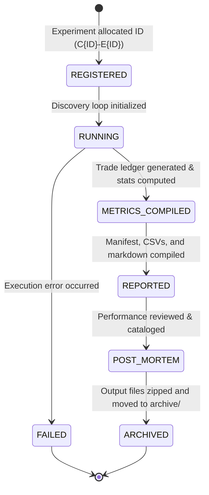

# QRP Framework v2.0 — Experiment Lifecycle & Registry Specification

This document specifies the lifecycle, dashboard models, reproducibility manifest schemas, logging requirements, and database transition logic for quantitative experiments within the **Quantitative Research Platform (QRP) Framework v2.0**.

---

## 1. Experiment Lifecycle States

To ensure statistical integrity and traceability, every individual parameter configuration and run (referred to as an **Experiment**) progresses through a formal state machine:



* **REGISTERED**: The `ExperimentManager` parses the parameters, allocates a permanent ID, creates the output folder structure, and writes the initial manifest shell.
* **RUNNING**: The `DiscoveryEngine` begins simulation loops, calling the plugin preprocessor and signal generators.
* **METRICS_COMPILED**: The backtest loop completes successfully, generating a raw transaction CSV. The `MetricsEngine` parses this CSV and computes execution statistics.
* **FAILED**: The sweep loop terminates unexpectedly (e.g., due to data holes or plugin code crashes). A failure dump and traceback are logged.
* **REPORTED**: The `ReportingEngine` creates the markdown execution summary and updates the active candidate dashboard.
* **POST_MORTEM**: The quantitative team reviews the results to determine candidate promotion classification (PASS, BORDERLINE, WATCHLIST, REJECT).
* **ARCHIVED**: The experiment folder is compressed and stored in `research_engine/archives/` to conserve space on discovery servers.

---

## 2. The Reproducibility Manifest

Every experiment must automatically generate a `manifest.json` file in its output folder. This manifest acts as a metadata record, containing all inputs required to rebuild the exact trading path:

```json
{
  "experiment_id": "C001-E0015",
  "candidate_id": "Candidate 01",
  "framework_version": "QRP Framework v2.0",
  "candidate_version": "v1.0.0",
  "git_commit": "e8d7f2a1b39c0498a58145d8b76c5f432a10e621",
  "timestamp": "2026-06-27T12:00:00Z",
  "timeframe": "1H",
  "universe": {
    "asset_class": "crypto",
    "symbols": ["BTC", "ETH", "SOL", "LINK", "AVAX"]
  },
  "parameters": {
    "lookback": 50,
    "portfolio_size": 3,
    "rebalance_frequency": 4,
    "stop_loss_multiplier": 3.0,
    "take_profit_multiplier": 3.0
  },
  "data_hash": "a1b2c3d4e5f6g7h8i9j0k1l2m3n4o5p6"
}
```

---

## 3. Multi-Candidate Dashboard Data Model

The `CandidateDashboard` tracks the active state of all strategies. The data model is persisted in `research_engine/outputs/dashboard_state.json` and supports simultaneous tracking across candidates:

```json
{
  "last_updated": "2026-06-27T12:22:00Z",
  "candidates": {
    "Candidate 01": {
      "name": "Relative Strength",
      "stage": "Discovery Sweep",
      "status": "RUNNING",
      "progress_pct": 45.5,
      "current_experiment": "C001-E0042",
      "experiments_completed": 41,
      "experiments_total": 90,
      "start_time": "2026-06-27T10:00:00Z",
      "end_time": null,
      "notes": "Running Variant B lookback sweeps on 1H timeframe."
    },
    "Candidate 02": {
      "name": "Mean Reversion",
      "stage": "Signal Design",
      "status": "READY_FOR_STAGE_3",
      "progress_pct": 100.0,
      "current_experiment": null,
      "experiments_completed": 0,
      "experiments_total": 0,
      "start_time": "2026-06-27T08:00:00Z",
      "end_time": "2026-06-27T09:30:00Z",
      "notes": "Signal Design Specification finalized."
    }
  }
}
```

---

## 4. Segmented Logging Policy

Logs must distinguish levels cleanly and be written to dedicated logs per experiment.

### A. Level Standards
* **INFO**: Initialization, parsing, progress updates (`"INFO: C001-E0015: Loading BTC 1H data..."`).
* **WARNING**: Configuration deviations or minor data issues (`"WARNING: C001-E0015: 14 missing candles filled on AVAX"`).
* **ERROR**: Execution crashes (`"ERROR: C001-E0015: Plugin generate_signals returned NaN value on SUI"`).
* **SUCCESS**: Successful completion of an experiment sweep (`"SUCCESS: C001-E0015: Sweep completed. PF: 1.42, Net return: 45.2%"`).

### B. Segmented Storage
To avoid text collisions, the logger directs runtime writes to:
`research_engine/outputs/C{CandidateID}/logs/E{ExperimentID}.log`

---

## 5. Post-Mortem Archiving Rules

To prevent bloating local disk storage with thousands of high-frequency trade files, the framework implements a compression pipeline:
1. When a research sweep finishes, raw trading files reside in the workspace.
2. Once the post-mortem report is compiled and registered, a command is issued to zip the directory:
   `zip -r research_engine/archives/C{CandidateID}_E{ExperimentID}.zip research_engine/outputs/C{CandidateID}/E{ExperimentID}/`
3. The raw directories are then deleted from the active workspace, leaving only the summary records in the registry database.
