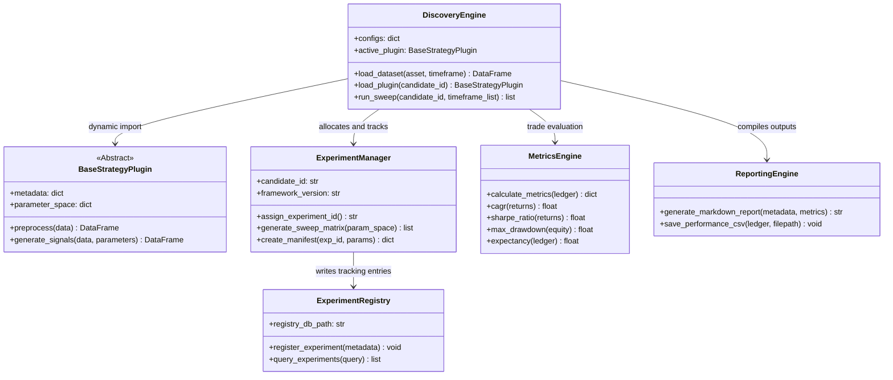
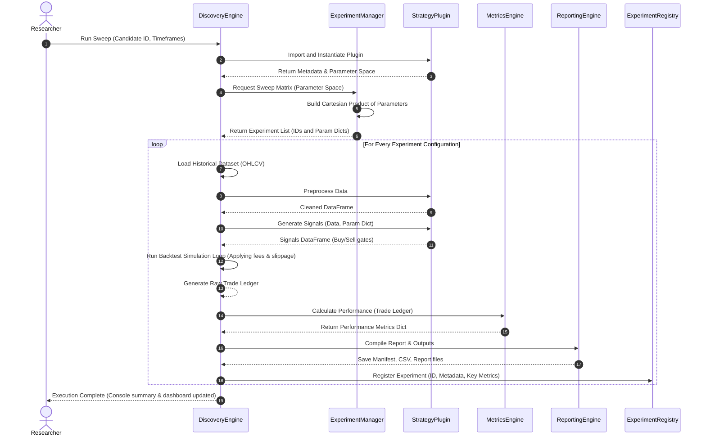

# QRP Framework v2.0 — Framework Design Document

This document details the software design, class structures, configuration schemas, and interaction flows for the **Quantitative Research Platform (QRP) Framework v2.0**.

---

## 1. Modular Interface Hierarchy

The framework is organized as a collection of core classes that interact using defined data contracts. 



---

## 2. Interaction Dynamics

The execution flow of a discovery parameter sweep is fully automated, passing data structures between the components chronologically:



---

## 3. Class Design & Module Specifications

### A. `discovery_engine.py` (Core Coordinator)
* **Functionality**: Loads datasets, loads strategy plugins dynamically, runs the sweep loop, handles asynchronous worker pools (multiprocessing per experiment configuration).
* **Key Functions**:
  * `load_dataset(asset: str, timeframe: str) -> pd.DataFrame`
  * `load_plugin(candidate_id: str) -> BaseStrategyPlugin`
  * `run_backtest(data: pd.DataFrame, params: dict) -> pd.DataFrame` (returns trade ledger)

### B. `experiment_manager.py` (Registry and ID manager)
* **Functionality**: Allocates unique IDs, builds parameter sweeping configurations, compiles reproducibility manifests.
* **Key Functions**:
  * `assign_experiment_id() -> str`
  * `generate_sweep_matrix(param_space: dict) -> List[dict]`
  * `create_manifest(exp_id: str, params: dict, git_hash: str) -> dict`

### C. `metrics_engine.py` (Statistical compiler)
* **Functionality**: Accepts standardized transaction logs and returns performance statistics.
* **Key Functions**:
  * `calculate_metrics(ledger: pd.DataFrame) -> dict`
  * `calculate_cagr(daily_returns: pd.Series) -> float`
  * `calculate_sharpe(daily_returns: pd.Series) -> float`
  * `calculate_drawdown(equity_curve: pd.Series) -> dict` (max drawdown, duration, recovery date)

### D. `reporting.py` (Output formatting)
* **Functionality**: Saves backtesting logs and outputs to disk, compiles final report summaries.
* **Key Functions**:
  * `write_markdown_report(exp_dir: Path, manifest: dict, metrics: dict) -> Path`
  * `export_trades_csv(exp_dir: Path, ledger: pd.DataFrame) -> Path`

### E. `logger.py` (Execution Tracing)
* **Functionality**: Custom class maintaining segregated logging handlers.
* **Key Functions**:
  * `get_experiment_logger(candidate_id: str, exp_id: str) -> logging.Logger`

---

## 4. Configuration Schemas

The central framework run settings are governed by a YAML schema (`research_engine/configs/runner.yaml`):

```yaml
framework:
  version: "QRP Framework v2.0"
  log_level: "INFO"
  max_workers: 4                 # Multiprocessing CPU allocation

data:
  root_dir: "./data"             # Path to historical databases
  asset_class: "crypto"          # Asset class adapter to load
  default_timeframes: ["15m", "1H", "4H"]

backtest:
  initial_capital: 10000.0       # Standardized baseline capital
  costs:
    taker_fee: 0.00045           # 0.045% Taker fee rate
    maker_fee: 0.00015           # 0.015% Maker fee rate
    slippage_rate: 0.0005        # 0.05% Slippage buffer
  leverage:
    max_cap: 5                   # Max isolated leverage cap

paths:
  outputs_dir: "./research_engine/outputs"
  archives_dir: "./research_engine/archives"
```

---

## 5. Standardized Data Structures

### A. Input Bar Structure (Pandas DataFrame)
Standardized index: `timestamp` (UTC datetime64)
Columns:
* `open` (float)
* `high` (float)
* `low` (float)
* `close` (float)
* `volume` (float)

### B. Output Trade Ledger Structure (Pandas DataFrame)
Columns:
* `trade_id` (str)
* `asset` (str)
* `direction` (str: `LONG` / `SHORT`)
* `entry_timestamp` (datetime)
* `entry_price` (float)
* `qty` (float)
* `exit_timestamp` (datetime)
* `exit_price` (float)
* `exit_reason` (str: `RANK_DECAY`, `STOP_LOSS`, `TAKE_PROFIT`, `TIME_EXIT`)
* `pnl_nominal` (float)
* `pnl_r` (float: PnL measured in units of initial risk)
* `fees_paid` (float)
* `slippage_paid` (float)
